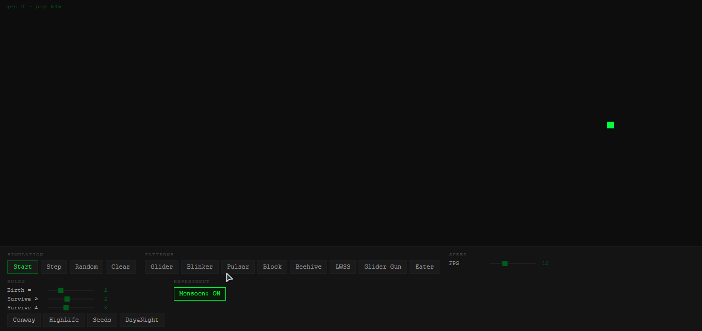

# Conway's Game of Life

<p align="center">
  
</p>

<p align="center">


</p>

<p align="center">
  <a href="https://definitelynotguru.github.io/GameOfLife"><strong>▶ Open live demo</strong></a>
  &ensp;·&ensp;
  <a href="#how-to-run">Run locally</a>
  &ensp;·&ensp;
  <a href="#rule-presets">Rule presets</a>
  &ensp;·&ensp;
  <a href="#experiments">Try an experiment</a>
</p>

<br>

A simulation where nothing moves on its own, and yet things travel, grow, collapse, and stabilize. Conway's Game of Life is a cellular automaton: a grid of cells, each alive or dead, updated each generation by four simple rules. No central control. No plan. Just local interactions producing global patterns that feel almost alive.

This repo is intentionally lightweight: plain HTML, a `<canvas>`, and one JavaScript file. No build step, no dependencies, no frameworks.

---

## How to run

**Local:** Clone or download, then open `index.html` in any browser. That's it.

```bash
git clone https://github.com/definitelynotguru/game-of-life.git
cd game-of-life
open index.html   # or double-click the file
```

**GitHub Pages:** The live demo runs directly from this repo at `https://definitelynotguru.github.io/game-of-life`.

---

## The four rules

Each cell looks at its 8 immediate neighbors. Every generation, all cells update simultaneously based on these rules:

| Condition | Live cell | Dead cell |
|-----------|-----------|-----------|
| < 2 live neighbors | Dies (underpopulation) | Stays dead |
| 2 or 3 live neighbors | Survives | — |
| > 3 live neighbors | Dies (overpopulation) | — |
| Exactly 3 live neighbors | — | Born (reproduction) |

This is the standard **B3/S23** ruleset (birth at 3, survival at 2 or 3). The sliders in the UI let you change these numbers and see what breaks, or what unexpected behavior emerges. Four rule presets are available for quick switching.

The grid wraps: the right edge connects to the left, the top to the bottom. Patterns that drift off one side come back on the other.

---

## What this looks like in the real world

The rules are abstract, but the dynamics they produce show up in places you recognize.

**Overcrowding (collapse).** A live cell with more than 3 neighbors dies. Think of a Mumbai chawl or dense informal settlement: too many people competing for the same water connection, the same narrow lane, the same electrical load. Beyond a threshold, the pressure does not sustain — people leave, structures fail, the cell empties.

**Just-right conditions (birth).** A dead cell with exactly 3 neighbors becomes alive. In Crawford Market or Dadar, a new hawker or small shop appears when foot traffic, adjacent businesses, and available pavement align just right. One too few and it does not happen. One too many and it is already saturated.

**Gliders (migration).** A glider is a 5-cell pattern that travels diagonally across the grid without dying. It does not have a destination — it just keeps moving. This is structurally similar to how a wave of people, or a rumor, or an idea moves through Mumbai's suburbs: one neighborhood to the next, sustained by local interactions, never quite stopping.

**Still lifes (resilient communities).** A 2x2 block never changes. Each cell has exactly 2 or 3 neighbors — just enough to survive, not enough to kill. These are the old family clusters in South Mumbai or Pune's old city, stable for generations despite everything happening around them.

**Oscillators (daily cycles).** The blinker flips between two states every generation. Street vendors appear at rush hour and pack up at night. Monsoon flooding periodically empties low-lying areas and they recover. The pulsar oscillates with period 3, a slower rhythm, like weekly market days.

None of this is a precise model. The analogy is not meant to be literal. But it is a way of asking: what happens when you change the rules? What if survival requires 3 neighbors instead of 2? What if birth needs 4 instead of 3?

---

## Controls

**Buttons**

| Button | What it does |
|--------|-------------|
| Start / Pause | Toggle the simulation (also: spacebar) |
| Step | Advance exactly one generation — useful for watching rules apply |
| Random | Fill the grid with ~30% random live cells |
| Clear | Empty the grid |
| Monsoon | Toggle random ~0.3% cell deaths per generation |

**Mouse / touch**

Click or drag on the canvas to toggle cells alive or dead while the simulation is running or paused. On mobile, draw with your finger.

**Sliders**

- **FPS** — simulation speed (1-30 frames per second)
- **Birth =** — number of neighbors needed to birth a dead cell (default: 3)
- **Survive >= / <=** — neighbor range for a live cell to survive (default: 2-3)

---

## Rule presets

One-click rule configurations. Each preset snaps the sliders to specific values. Some rules use multi-value birth or survival sets (e.g., HighLife births at 3 or 6); the sliders approximate these with the primary value.

| Preset | Birth | Survive | Description |
|--------|-------|---------|-------------|
| **Conway** | 3 | 2-3 | Standard B3/S23 |
| **HighLife** | 3 (or 6) | 2-3 | B36/S23 — has self-replicating patterns |
| **Seeds** | 2 | none | B2/S — everything explodes, nothing persists |
| **Day & Night** | 3,6,7,8 | 3,4,6,8 | B3678/S34678 — symmetric stable patterns |

**HighLife** is particularly interesting: the B36 rule means a cell also births at 6 neighbors. This produces replicators — patterns that copy themselves. Run HighLife with Random and watch for self-reproducing structures.

**Seeds** is explosive: since nothing survives, any live cell dies in one generation. The population crashes immediately, but the chaos can leave behind stable debris.

**Day & Night** is symmetric: if you invert the grid (alive becomes dead, dead becomes alive), the dynamics are the same. It produces large stable structures that look like creatures.

---

## Population graph

The bottom 80px of the canvas shows a rolling population graph. Each generation plots the live cell count over the last 200 generations, auto-scaling to the visible window so recent activity always fills the graph.

This turns the simulation into an observation tool: watch population curves settle, boom, crash, or oscillate under different rules. The Mumbai-themed experiments (birth=4 for "strict zoning", monsoon for "disasters") become directly visible as shape differences in the curve.

---

## Patterns

Load any of these from the pattern buttons. Each one clears the grid and places the pattern centered.

**Glider** — 5 cells. Travels diagonally one cell every 4 generations. The simplest moving pattern. John Conway himself considered it a kind of signal — proof that information could propagate in a zero-player system.

**Blinker** — 3 cells in a row. Period-2 oscillator: alternates between horizontal and vertical. The simplest oscillator. Shows up everywhere in random starts.

**Pulsar** — 48 cells. Period-3 oscillator with 4-fold symmetry. One of the most recognizable patterns. Common in naturally evolved chaos.

**Block** — 2x2 square. Completely static. Each cell has exactly 3 neighbors — survival holds, overcrowding never triggers. A perfect closed community.

**Beehive** — 6 cells. Another still life. More elongated than the block, but equally stable. Turns up frequently when random patterns settle.

**LWSS** — 9 cells. Lightweight Spaceship travels horizontally across the grid. The first of many possible spaceship speeds — once you have one, you can collide it with anything.

**Glider Gun** — 36 cells. The Gosper Glider Gun fires a new glider every 30 generations. This is infinite growth from a finite starting configuration — a fundamental result in cellular automata theory.

**Eater** — 9 cells. Stable structure that absorbs an incoming glider and survives intact. Use it to redirect gliders or protect stable formations.

To draw your own: click Clear, then click/drag cells into position, then hit Start.

---

## Experiments

These are things worth actually trying (not just descriptions of what you could do).

**Use the rule presets.** Click HighLife and hit Random. Watch for replicators: patterns that build copies of themselves. Seeds is also worth 30 seconds of chaos.

**Raise birth threshold to 4.** Change the Birth slider from 3 to 4 (or use the sliders after any preset). A dead cell now needs 4 neighbors to come alive. Watch how slowly (or not at all) structure emerges from a random seed. This is what strict zoning laws do to city growth: higher thresholds for new construction slow everything down, and some patterns that would have formed simply never appear.

**Tighten survival.** Set Survive >= and Survive <= both to 3. A live cell now needs exactly 3 neighbors to survive — 2 is no longer safe. Watch how quickly populations collapse. Only very specific configurations hold.

**Turn on monsoon mode.** With a running simulation, hit the Monsoon button. Small random deaths start appearing (models floods, evictions, or disease outbreaks disrupting otherwise stable areas). Watch whether stable patterns survive it or whether the randomness eventually finds them.

**Combine: birth = 4 + monsoon on.** Slow growth and random disruption together. This is a genuinely harsh environment. See what survives, if anything.

**Draw a glider toward a block.** Load a glider, then pause and draw a 2x2 block somewhere in its path. Run it. The collision either destroys both, leaves debris, or leaves one intact depending on exact timing. These interactions are worth watching frame by frame using Step.

**Watch the population graph under different rules.** Start with Conway and Random. Note the typical curve shape. Then switch to HighLife and compare. Then Seeds. The graphs tell different stories.

To find the rule constants in the code directly: open `script.js`, look for `RULE_PRESETS` near the top.

---

## File structure

```
game-of-life/
├── index.html      # canvas, controls, all layout — no external CSS files
├── script.js       # grid logic, rendering, event handlers (~465 lines)
├── assets/
│   └── demo.gif    # screen recording of simulation in action
├── .gitignore
├── LICENSE         # MIT
└── README.md
```

---

## Code notes

The core loop uses `requestAnimationFrame` with a timestamp check to control speed. The grid uses two arrays (`grid` and `nextGrid`) that swap each generation rather than allocating fresh arrays. Age is tracked in a third array (`ageGrid`): cells alive for 15+ consecutive generations render in a deeper green, making stable patterns visually distinct from active growth.

The population graph uses a separate canvas layered at the bottom of the canvas container, drawing a rolling 200-generation line chart with auto-scaling Y-axis per visible window.

The grid is toroidal. Neighbor counting uses modulo arithmetic so edges connect seamlessly. All of this is in `applyRules()` and `countNeighbors()` in `script.js`, with inline comments explaining each non-obvious step.

---

## License

MIT. Do what you want with it.

---

*Built to understand how simple rules produce complex behavior, and what that might say about cities, populations, and systems that organize themselves without anyone in charge.*
